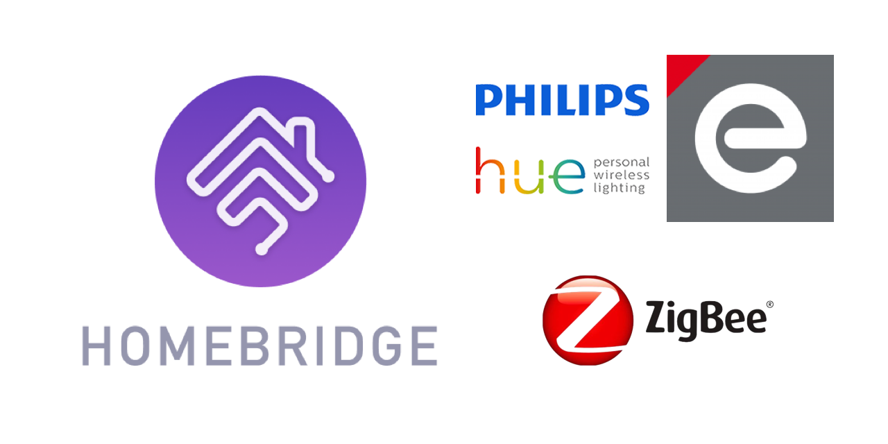

<p align="center">
    
</p>
<span align="center">

# Homebridge Hue
[](https://www.npmjs.com/package/homebridge-hue)
[](https://www.npmjs.com/package/homebridge-hue)
[](https://discord.gg/hZubhrz)
[](https://github.com/homebridge/homebridge/wiki/Verified-Plugins)

[](https://github.com/ebaauw/homebridge-hue/issues)
[](https://github.com/ebaauw/homebridge-hue/pulls)
[](https://standardjs.com)

</span>

## Homebridge plugin for Philips Hue
Copyright © 2016-2026 Erik Baauw. All rights reserved.

### Introduction
This [Homebridge](https://github.com/homebridge/homebridge) plugin exposes to Apple's [HomeKit](http://www.apple.com/ios/home/) Hue-compatible devices (lights, plugs, sensors, switches, ...) connected to a [Hue](http://www2.meethue.com/) bridge by Signify.

Note that Hue was originally developed by Philips, before they split off their Lighting division into Signify.
Signify are still using the Philips Hue brand name.

See the [Wiki](https://github.com/ebaauw/homebridge-hue/wiki/Features) for a list of Homebridge Hue features and supported devices, including a comparison of the features of:
- The native HomeKit function of the gen-2 (square) Hue bridge; of
- The native Matter function of the gen-2 (square) Hue bridge, connected to HomeKit; of
- Homebridge Hue in combination with a Hue bridge; and of
- [Homebridge deCONZ](https://github.com/ebaauw/homebridge-deconz) in combination with a deCONZ gateway.

Homebridge Hue does automatic discovery of Hue bridges.
It supports multiple bridges from one installation.
It supports both the v2 (square) and v1 (round) Hue bridge.
It works in combination with the native HomeKit functionality of the v2 Hue bridge.

Please see the [Wiki](https://github.com/ebaauw/homebridge-hue/wiki) for a detailed description of Homebridge Hue.

### Prerequisites
You need a Philips Hue bridge to connect Homebridge Hue to your Hue-compatible lights, switches, and sensors.
I recommend using the latest Hue bridge firmware, with API v1.61.0 (v2 bridge) or v1.16.0 (v1 bridge) or higher.

You need a server to run Homebridge.
This can be anything running [Node.js](https://nodejs.org): from a Raspberry Pi, a NAS system, or an always-on PC running Linux, macOS, or Windows.
See the [Homebridge Wiki](https://github.com/homebridge/homebridge/wiki) for details.
I recommend using wired Ethernet to connect the server running Homebridge, the Hue bridge, and the AppleTV acting as home hub.

To interact with HomeKit, you need Siri or a HomeKit app on an iPhone, Apple Watch, iPad, iPod Touch, or Apple TV (4th generation or later).
I recommend to use the latest released versions of iOS, watchOS, and tvOS.  
Please note that Siri and even Apple's [Home](https://support.apple.com/en-us/HT204893) app still provide only limited HomeKit support.
To use the full features of Homebridge Hue, you might want to check out some other HomeKit apps, like the [Eve](https://www.evehome.com/en/eve-app) app (free) or Matthias Hochgatterer's [Home+](https://hochgatterer.me/home/) app (paid).

As HomeKit uses multicast-DNS (a.k.a. Bonjour) to discover Homebridge, the server running Homebridge must be on the same subnet as your iDevices running HomeKit.
For remote access and for HomeKit automations (incl. support for wireless switches), you need to setup an Apple TV (4th generation or later) or HomePod as [home hub](https://support.apple.com/en-us/HT207057).

### Command-Line Utility
Homebridge Hue includes the `ph` command-line utility to interact with the Hue API from the command line.
See the [tutorial](https://github.com/ebaauw/homebridge-hue/wiki/ph-Tutorial) on the Wiki for an introduction to this utility.

Issue `ph -h` or `ph --help` to provide a brief overview of its functionality and command-line arguments.

### Installation
To install Homebridge Hue:
- Follow the instructions on the [Homebridge Wiki](https://github.com/homebridge/homebridge/wiki) to install Node.js and Homebridge;
- Install the Homebridge Hue plugin through Homebridge Config UI X or manually by:
  ```
  $ sudo npm -g i homebridge-hue
  ```

- Edit `config.json` and add the `Hue` platform provided by Homebridge Hue, see [**Configuration**](#configuration);
- Run Homebridge Hue for the first time, press the link button on (each of) your bridge(s).  Note the bridge ID/API key pair for each bridge in the log output.  Edit `config.json` to include these, see [**Configuration**](#configuration).  
Note that you cannot add these through the Homebridge Hue *Settings* in Homebridge Config UI X, but you can use the *Homebridge Config Editor*.

To update Homebridge Hue, simply issue another `sudo npm -g i homebridge-hue@latest`.  Please check the [release notes](https://github.com/ebaauw/homebridge-hue/releases) before updating Homebridge Hue.  Note that a change to the minor version typically indicates that you need to review/redo your HomeKit configuration.  Due to changes in the mapping how Hue bridge resources are exposed, HomeKit might treat them as new accessories, services, and/or characteristics, losing any assignment to HomeKit rooms, scenes, actions, and triggers.  To revert to a previous version, specify the version when installing Homebridge Hue, as in: `sudo npm -g i homebridge-hue@0.13.70`.

### Configuration
In Homebridge's `config.json` you need to specify Homebridge Hue as a platform plugin.  Furthermore, you need to specify what you want to expose to HomeKit.  See the [Wiki](https://github.com/ebaauw/homebridge-hue/wiki/Configuration) for a complete reference of the `config.json` settings used by Homebridge Hue, and for some examples.

For finer-grained control of what resources Homebridge Hue exposes to HomeKit, and how, create resource links on the bridge, see the [Wiki](https://github.com/ebaauw/homebridge-hue/wiki/Resource-Links).

### Troubleshooting

Please check the [FAQ](https://github.com/ebaauw/homebridge-hue/wiki/FAQ).

#### Check Dependencies
If you run into Homebridge startup issues, please double-check what versions of Node.js and of Homebridge have been installed.
Homebridge Hue has been developed and tested using the [latest LTS](https://nodejs.org/en/about/previous-releases) version of Node.js and the [latest](https://www.npmjs.com/package/homebridge) version of Homebridge.
Other versions might or might not work - I simply don't have the bandwidth to test these.

#### Run Homebridge Hue Solo
If you run into Homebridge startup issues, please run a separate instance of Homebridge with only Homebridge Hue (and Homebridge Config UI X) enabled in `config.json`.
This way, you can determine whether the issue is related to Homebridge Hue itself, or to the interaction of multiple Homebridge plugins in your setup.
You can start this separate instance of Homebridge on a different system, as a different user, or from a different user directory (specified by the `-U` flag).
Make sure to use a different Homebridge `name`, `username`, and (if running on the same system) `port` in the `config.json` for each instance.

#### Debug Log File
Homebridge Hue outputs an info message for each HomeKit characteristic value it sets and for each HomeKit characteristic value change notification it receives.
When Homebridge is started with `-D`, Homebridge Hue outputs a debug message for each request it makes to the bridge, for each state change it detects while polling the bridge, and for each push notification it receives from gen-2 Hue bridge event stream.  Additionally, it issues a debug message for each bridge resource it detects.

To capture these messages into a log file do the following:
- If you're running Homebridge as a service, stop that service;
- Run Homebridge manually, capturing the output into a file, by issuing:
  ```
  $ homebridge -CD 2>&1 | tee homebridge.log
  ```
- Interact with your devices, through their native app and or through HomeKit to trigger the issue;
- Hit interrupt (ctrl-C) to stop Homebridge;
- If you're running Homebridge as a service, restart the service;
- Compress the log file by issuing:
  ```
  $ gzip homebridge.log
  ```

#### Debug Dump File
To aid troubleshooting, on startup, Homebridge Hue dumps its environment, including its `config.json` settings and the full state of all bridges into a compresed json file, `homebridge-hue.json.gz`.
IP addresses, and bridge API keys are masked.
This file is created in the Homebridge user directory, `~/.homebridge` by default.
It can be downloaded through the Homebridge Config UI X user interface, from the Homebridge Hue _SETTINGS_ popup window, on the _Plugins_ tab.

#### Getting help
If you have a question, please post a message to the **#hue** channel of the Homebridge community on [Discord](https://discord.gg/hZubhrz).

If you encounter a problem, please open an issue on [GitHub](https://github.com/ebaauw/homebridge-hue/issues).
Please attach a copy of `homebridge-hue.json.gz` to the issue, see [**Debug Dump File**](#debug-dump-file).
Please attach a copy of `homebridge.log.gz` to the issue, see [**Debug Log File**](#debug-log-file).
Please do **not** copy/paste large amounts of log output.

### Contributing
Sometimes I get the question how people can support my work on Homebridge Hue.
I created Homebridge Hue as a hobby project, for my own use.
I share it on GitHub so others might benefit, and to give back to the open source community, without whom Homebridge Hue wouldn't have been possible.

Having said that, adding support for new devices, in Homebridge Hue, is very hard without having physical access to the device.
Since this is a hobby project, I cannot afford to spend money on devices I won't be using myself, just to integrate them for the benefit of others.
I am happy to receive small donations in the form of new devices to integrate, or the money to buy these devices myself.
I am also happy to return the devices afterwards, if you provide the shipping costs.
Please contact me by email or on Discord for shipping details.

### Caveats
Homebridge Hue is a hobby project of mine, provided as-is, with no warranty whatsoever.  I've been running it successfully at my home for years, but your mileage might vary.

The HomeKit terminology needs some getting used to.
An _accessory_ more or less corresponds to a physical device, accessible from your iOS device over WiFi or Bluetooth.
A _bridge_ (like Homebridge) is an accessory that provides access to other, bridged, accessories.
An accessory might provide multiple _services_.
Each service corresponds to a virtual device (like a lightbulb, switch, motion sensor, ..., but also: a programmable switch button, accessory information, battery status).
Siri interacts with services, not with accessories.
A service contains one or more _characteristics_.
A characteristic is like a service attribute, which might be read or written by HomeKit apps.
You might want to checkout Apple's [HomeKit Accessory Simulator](https://developer.apple.com/documentation/homekit/testing_your_app_with_the_homekit_accessory_simulator), which is distributed as an additional tool for `Xcode`.

Internally, HomeKit identifies accessories by UUID.  For Zigbee devices (lights, sensors, switches), Homebridge Hue bases this UUID on the Zigbee mac address.  For non-Zigbee resources (groups, schedules, CLIP sensors), the UUID is based on the bridge ID and resource path (e.g. `/sensors/1`).  By not using the resource name (e.g. `Daylight`), Homebridge Hue can deal with duplicate names.  In addition, HomeKit will still recognise the accessory after the resource name has changed on the bridge, remembering which HomeKit room, groups, scenes, actions, and triggers it belongs to.  However, when a non-Zigbee bridge resource is deleted and then re-created, resulting in a different resource path, HomeKit will treat it as a new accessory, and you will need to re-configure HomeKit.
